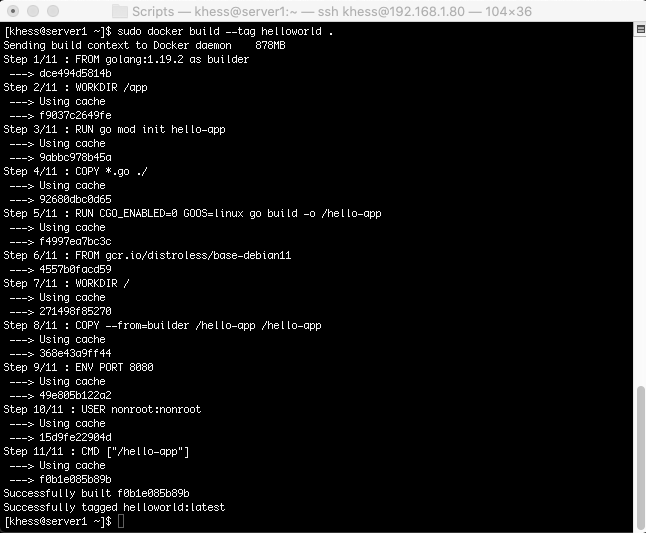
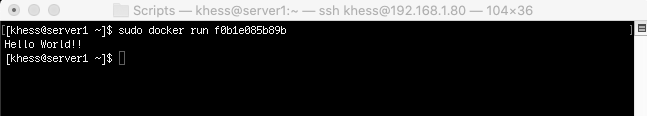

# Deploying an application as a workload to a Kubernetes cluster
This short tutorial demonstrates how to deploy a sample HelloWorld application as a workload to a Kubernetes cluster using the hello-app project at https://github.com/GoogleCloudPlatform/kubernetes-engine-samples/tree/main/hello-app.

This tutorial assumes that you have a working Kubernetes cluster.

This example uses a CentOS 8.5 Linux system as the host.

## 1 Download and Save the Working Files
Download **main.go** and **Dockerfile** from https://github.com/GoogleCloudPlatform/kubernetes-engine-samples/tree/main/hello-app.

Save the files to your home or a working directory.

## 2 Build the Docker Container

Issue the following command:

    sudo docker build --tag helloworld .
    

This process will take several minutes. You will see output similar to that shown in the image.

## 3 Run the Application

Run the application using the container name from the previous command output, f0b1e085b89b.

    sudo docker run f0b1e085b89b
    

You will see the output shown in the image.

## 4 This is the end of the exercise

